# Health Care Management System - Docker Architecture (Mermaid)

## Container Communication Flow

```mermaid
graph TB
    subgraph "Host System (Ubuntu Linux)"
        subgraph "Docker Network: healthcare-network"
            subgraph "Frontend Container"
                F1[🌐 React App<br/>Vite Build]
                F2[📦 Nginx Server<br/>Port 80]
                F3[🔍 Health Check<br/>/health]
                F1 --> F2
                F2 --> F3
            end
            
            subgraph "Backend Container"
                B1[🔧 Node.js App<br/>Express Server]
                B2[🗃️ Prisma ORM<br/>Database Client]
                B3[🔍 Health Check<br/>/health]
                B4[📡 API Endpoints<br/>/api/*]
                B1 --> B2
                B1 --> B3
                B1 --> B4
            end
            
            subgraph "Database Container"
                D1[🗄️ PostgreSQL 15<br/>Alpine Linux]
                D2[🔍 Health Check<br/>pg_isready]
                D3[🔐 SCRAM-SHA-256<br/>Authentication]
                D1 --> D2
                D1 --> D3
            end
            
            subgraph "Docker Volume"
                V1[💾 postgres_data<br/>Persistent Storage]
            end
        end
        
        subgraph "Host Ports"
            P1[🌐 Port 5173<br/>Frontend Access]
            P2[🔧 Port 3002<br/>Backend API]
            P3[🗄️ Port 5432<br/>Database Access]
        end
    end
    
    subgraph "External Access"
        U1[👤 Users<br/>Web Browser]
        U2[🔧 Developers<br/>API Testing]
        U3[🗄️ Database<br/>Admin Tools]
    end
    
    %% External connections
    U1 -->|HTTP Requests| P1
    U2 -->|API Calls| P2
    U3 -->|SQL Queries| P3
    
    %% Port mappings
    P1 -->|5173:80| F2
    P2 -->|3002:3002| B1
    P3 -->|5432:5432| D1
    
    %% Internal communication
    F2 -->|API Proxy<br/>/api/*| B1
    B2 -->|SQL Queries<br/>Prisma Client| D1
    D1 -->|Data Storage| V1
    
    %% Health checks
    F3 -.->|30s interval| F2
    B3 -.->|30s interval| B1
    D2 -.->|30s interval| D1
    
    %% Styling
    classDef frontend fill:#61DAFB,stroke:#333,stroke-width:2px,color:#000
    classDef backend fill:#68A063,stroke:#333,stroke-width:2px,color:#fff
    classDef database fill:#336791,stroke:#333,stroke-width:2px,color:#fff
    classDef volume fill:#4ECDC4,stroke:#333,stroke-width:2px,color:#000
    classDef port fill:#FF8C42,stroke:#333,stroke-width:2px,color:#fff
    classDef user fill:#F7DC6F,stroke:#333,stroke-width:2px,color:#000
    
    class F1,F2,F3 frontend
    class B1,B2,B3,B4 backend
    class D1,D2,D3 database
    class V1 volume
    class P1,P2,P3 port
    class U1,U2,U3 user
```

## Service Architecture Details

## Container Health Monitoring

## Docker Compose Configuration

## Performance & Resource Usage

| Component | Memory Usage | Image Size | Startup Time | Port Mapping |
|-----------|-------------|------------|--------------|--------------|
| Frontend | ~15MB | ~45MB | ~3 seconds | 5173:80 |
| Backend | ~45MB | ~180MB | ~4 seconds | 3002:3002 |
| Database | ~25MB | ~240MB | ~3 seconds | 5432:5432 |
| **Total** | **~85MB** | **~465MB** | **<10 seconds** | **3 ports** |

## Key Features

- ✅ **Multi-stage builds** for optimized image sizes
- ✅ **Health checks** with automatic restart policies
- ✅ **Custom Docker network** for service isolation
- ✅ **Persistent volumes** for database data
- ✅ **Non-root users** for security hardening
- ✅ **Alpine Linux** base images for minimal footprint
- ✅ **API proxy** configuration in Nginx
- ✅ **Environment-based** configuration management
