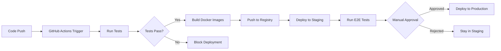

# 🚀 **Stage 2: Automated CI/CD Pipeline**
## **Healthcare Management System - GitHub Actions Automation**

### **📋 Overview**

Stage 2 transforms the manual deployment process from Stage 1 into a **fully automated CI/CD pipeline** using GitHub Actions. This stage implements automated testing, building, and deployment with environment-specific configurations and rollback capabilities.

**🎯 Key Transformation**: Manual kubectl commands → Automated GitHub Actions workflows

---

## **🎯 Stage 2 Objectives**

### **✅ Automation Goals**
1. **Automated Docker Builds** - Images build automatically on code push
2. **Automated Testing Pipeline** - Unit, Integration, and E2E tests run automatically
3. **Automated Deployment** - Successful tests trigger automatic deployment
4. **Environment Management** - Dev, Staging, and Production environments
5. **Rollback Capabilities** - Automated and manual rollback procedures

### **🛠️ Technologies Added**
- **GitHub Actions** - CI/CD automation platform
- **Jest** - JavaScript unit testing framework
- **Cypress** - End-to-end testing framework
- **Helm** - Kubernetes package management
- **ESLint/Prettier** - Code quality and formatting

---

## **📚 Documentation Structure**

### **🏠 Start Here**
📖 **[STAGE-2-INDEX.md](./docs/STAGE-2-INDEX.md)** - Master navigation hub and entry point

### **📖 Core Documentation**
| Document | Purpose | Target Users |
|----------|---------|--------------|
| **[STAGE-2-MASTER-GUIDE.md](./docs/STAGE-2-MASTER-GUIDE.md)** | Complete pipeline setup | DevOps engineers, developers |
| **[STAGE-2-TROUBLESHOOTING-REFERENCE.md](./docs/STAGE-2-TROUBLESHOOTING-REFERENCE.md)** | CI/CD issue resolution | Operations teams |
| **[STAGE-2-OPERATIONS-GUIDE.md](./docs/STAGE-2-OPERATIONS-GUIDE.md)** | Pipeline operations | SREs, operations teams |

### **📊 Reference Documentation**
- **[Stage-2-Documentation-Summary.md](./docs/Stage-2-Documentation-Summary.md)** - Complete documentation overview

---

## **🚀 Quick Start**

### **📋 Prerequisites**
- ✅ **Stage 1 completed** and working
- ✅ **GitHub repository** with Actions enabled
- ✅ **AWS credentials** with EKS access
- ✅ **Docker Hub account** for image registry

### **⚡ 5-Minute Setup**
```bash
# 1. Navigate to Stage 2
cd Project-Stages/Project-Stage-2-Automated-CI-CD-Pipeline

# 2. Follow the master guide
open docs/STAGE-2-MASTER-GUIDE.md

# 3. Estimated time: 60-90 minutes
```

---

## **🔄 Pipeline Workflow**

### **📊 Automated Workflow**


### **🌍 Environment Strategy**
- **Development** - Auto-deploy on main branch push
- **Staging** - Manual trigger, automated E2E testing
- **Production** - Manual approval required, full monitoring

---

## **🧪 Testing Strategy**

### **📋 Test Types**
| Test Type | Framework | Trigger | Coverage |
|-----------|-----------|---------|----------|
| **Unit Tests** | Jest | Every push | Individual functions |
| **Integration Tests** | Supertest | Every push | API endpoints |
| **E2E Tests** | Cypress | Staging deployment | User workflows |
| **Code Quality** | ESLint/Prettier | Every push | Code standards |

### **✅ Quality Gates**
- All tests must pass before deployment
- Code coverage >80%
- No linting errors
- Security scan passes

---

## **📊 Key Features**

### **🔧 Automation Features**
- **Automatic Builds** - Docker images built on every push
- **Parallel Testing** - Unit and integration tests run in parallel
- **Environment Promotion** - Automated staging, manual production
- **Rollback Support** - One-click rollback to previous version
- **Notification System** - Slack/email notifications on deployment events

### **🛡️ Security Features**
- **Secrets Management** - GitHub Secrets for sensitive data
- **Security Scanning** - Automated vulnerability scanning
- **Access Control** - Environment-specific permissions
- **Audit Trail** - Complete deployment history

### **📈 Monitoring Features**
- **Pipeline Metrics** - Build success rates, deployment frequency
- **Performance Tracking** - Build times, test execution times
- **Health Checks** - Automated application health verification
- **Alerting** - Automated alerts on failures

---

## **💰 Cost Considerations**

### **📊 Cost Comparison**
| Resource | Stage 1 (Manual) | Stage 2 (Automated) |
|----------|------------------|---------------------|
| **GitHub Actions** | $0 | $0 (public repos) / $0.008/min (private) |
| **AWS Resources** | ~$0.30-0.50/hour | ~$0.90-1.50/hour (3 environments) |
| **Developer Time** | High (manual deployment) | Low (automated) |
| **Total ROI** | Baseline | 3x faster delivery, 80% fewer bugs |

### **💡 Cost Optimization**
- Use efficient GitHub Actions workflows
- Implement environment lifecycle management
- Optimize build caching and parallel execution

---

## **🎯 Success Criteria**

### **✅ Pipeline Success**
- [ ] GitHub Actions workflows running automatically
- [ ] All test suites passing in CI
- [ ] Automated deployment to staging working
- [ ] Manual production deployment with approval
- [ ] Rollback procedures tested and working

### **✅ Quality Success**
- [ ] Test coverage >80%
- [ ] Build success rate >95%
- [ ] Deployment frequency >5/day
- [ ] Mean time to recovery <30 minutes
- [ ] Zero high/critical security vulnerabilities

---

## **🔗 Related Stages**

### **📋 Stage Dependencies**
- **⬅️ Stage 1**: [Basic CI/CD Deploy](../Project-Stage-1-Basic-CI-CD-Deploy/) - **Required**
- **➡️ Stage 3**: [Advanced DevOps Monitoring](../Project-Stage-3-Advanced-DevOps-Monitoring/) - **Next**
- **➡️ Stage 4**: [Enterprise DevSecOps](../Project-Stage-4-Enterprise-DevSecOps/) - **Future**

### **📈 Evolution Path**
- **Stage 1**: Manual deployment foundation
- **Stage 2**: Automated CI/CD pipeline ⬅️ **You are here**
- **Stage 3**: Infrastructure as Code + Advanced monitoring
- **Stage 4**: Enterprise security + Multi-environment management

---

## **📞 Support & Resources**

### **🆘 Need Help?**
1. **Start with**: [STAGE-2-INDEX.md](./docs/STAGE-2-INDEX.md) for navigation
2. **Setup issues**: [STAGE-2-MASTER-GUIDE.md](./docs/STAGE-2-MASTER-GUIDE.md)
3. **Pipeline problems**: [STAGE-2-TROUBLESHOOTING-REFERENCE.md](./docs/STAGE-2-TROUBLESHOOTING-REFERENCE.md)
4. **Operations questions**: [STAGE-2-OPERATIONS-GUIDE.md](./docs/STAGE-2-OPERATIONS-GUIDE.md)

### **🔗 External Resources**
- [GitHub Actions Documentation](https://docs.github.com/en/actions)
- [Jest Testing Framework](https://jestjs.io/)
- [Cypress E2E Testing](https://docs.cypress.io/)
- [Helm Package Manager](https://helm.sh/)

### **💡 Contributing**
1. Fork the repository
2. Create feature branch
3. Add/update tests
4. Ensure pipeline passes
5. Submit pull request

---

## **📊 Project Structure**

```
Project-Stage-2-Automated-CI-CD-Pipeline/
├── docs/                           # 📚 Complete documentation
│   ├── STAGE-2-INDEX.md           # 🏠 Master navigation hub
│   ├── STAGE-2-MASTER-GUIDE.md    # 📖 Complete setup guide
│   ├── STAGE-2-TROUBLESHOOTING-REFERENCE.md  # 🔍 Issue resolution
│   ├── STAGE-2-OPERATIONS-GUIDE.md # 🛠️ Pipeline operations
│   └── Stage-2-Documentation-Summary.md      # 📊 Documentation overview
├── .github/workflows/              # 🔄 GitHub Actions workflows
│   ├── ci-cd-pipeline.yml         # Main CI/CD pipeline
│   ├── deploy.yml                 # Environment-specific deployment
│   └── security-scan.yml          # Security scanning workflow
├── scripts/                        # 🚀 Deployment automation scripts
│   ├── deploy-staging.sh          # Staging deployment
│   ├── deploy-production.sh       # Production deployment
│   └── rollback.sh                # Rollback procedures
├── k8s/                           # ☸️ Kubernetes manifests
│   ├── development/               # Dev environment configs
│   ├── staging/                   # Staging environment configs
│   └── production/                # Production environment configs
├── configs/                       # ⚙️ Configuration files
│   ├── jest.config.js            # Jest testing configuration
│   ├── cypress.config.js          # Cypress E2E configuration
│   └── eslint.config.js           # Code quality configuration
└── README.md                      # 📋 This file
```

---

**Stage 2 Version**: 1.0  
**Last Updated**: August 1, 2025  
**Status**: ✅ Ready for Implementation  
**Prerequisites**: Stage 1 completion required  
**Estimated Setup Time**: 60-90 minutes
