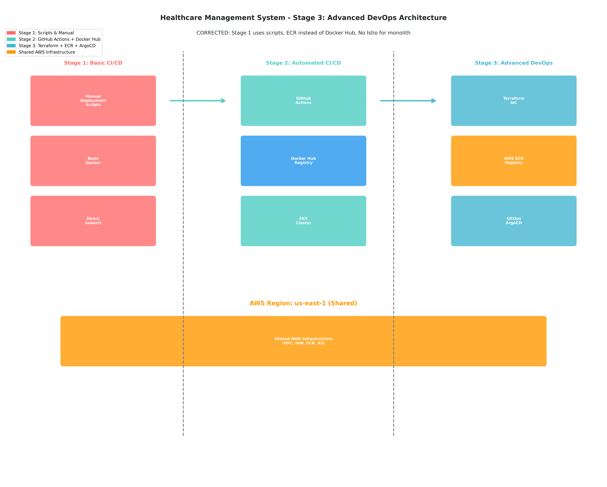
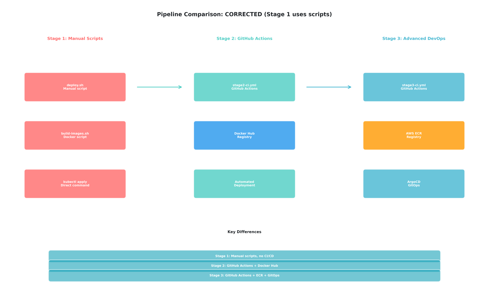
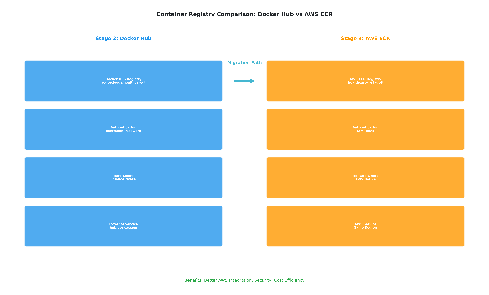
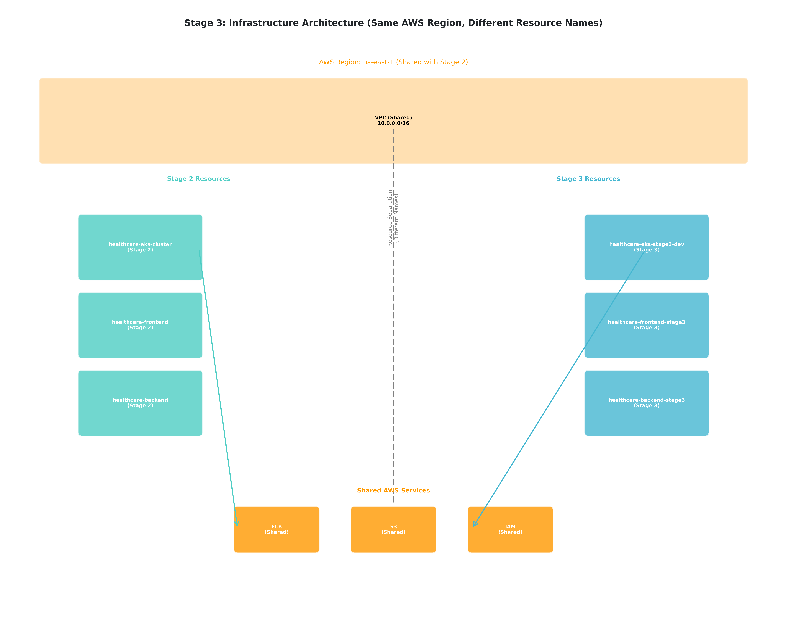
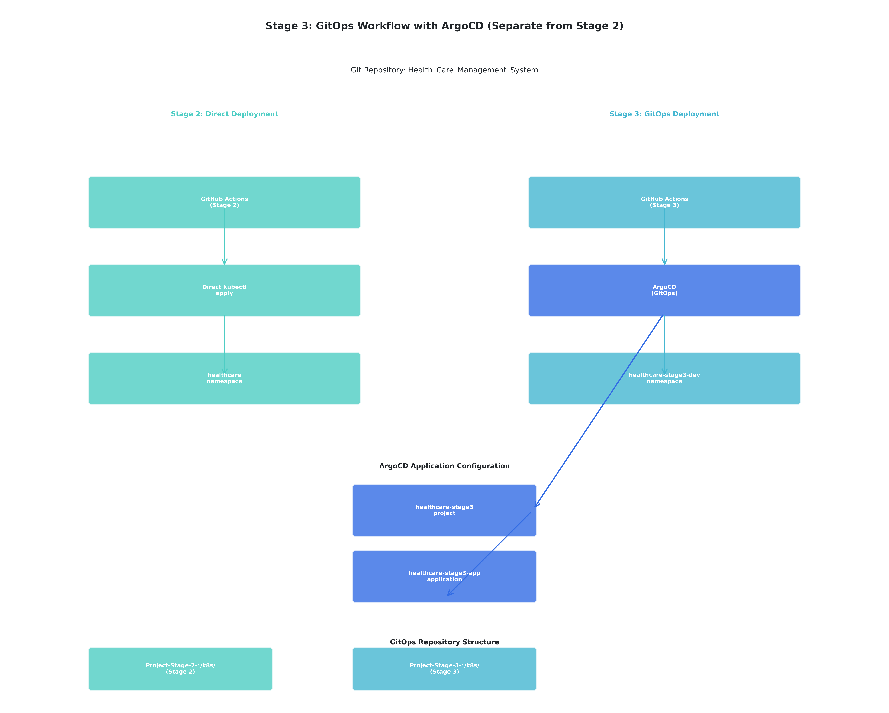
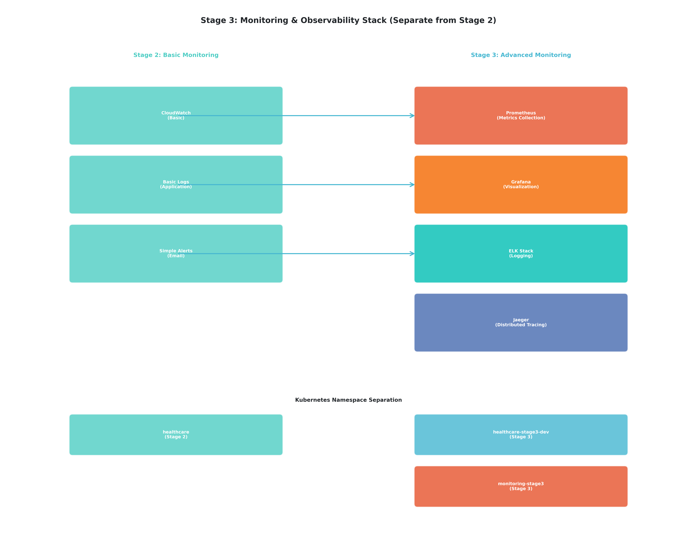
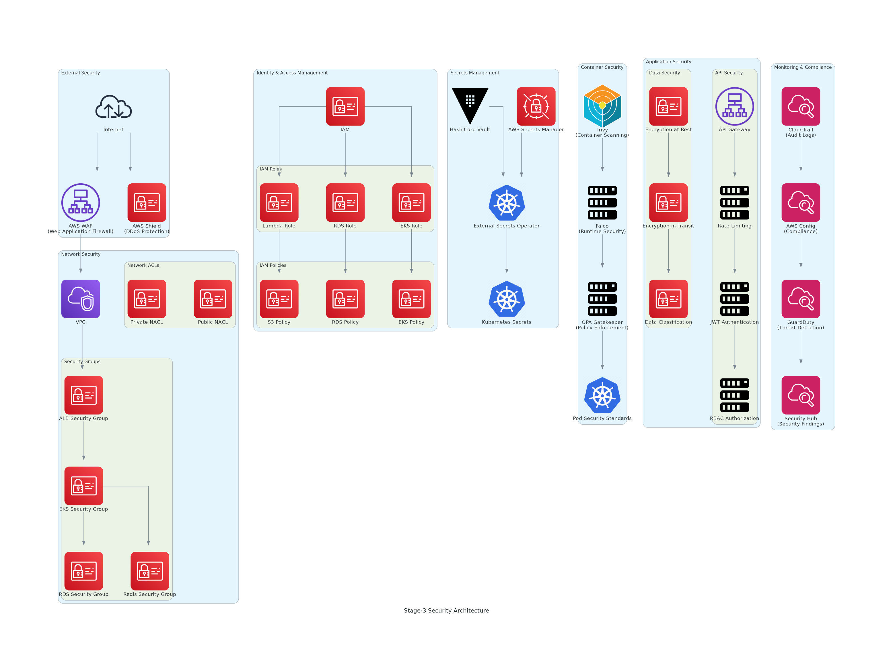
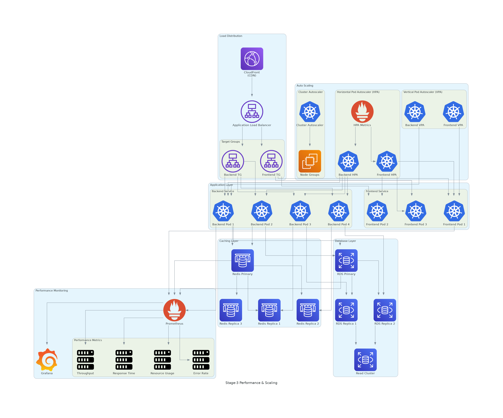
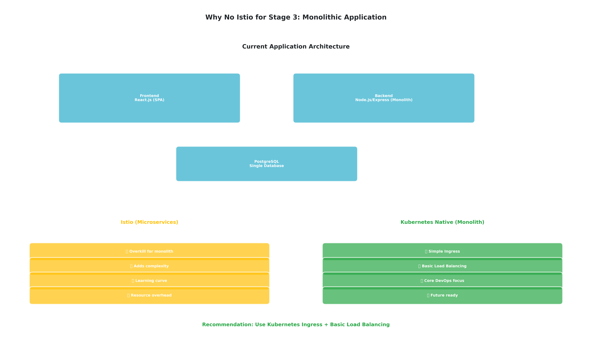

# Stage-3 Architecture Guide

## 📋 Table of Contents

1. [Overall Architecture](#overall-architecture)
2. [Stage Evolution](#stage-evolution)
3. [Container Registry Strategy](#container-registry-strategy)
4. [Infrastructure as Code](#infrastructure-as-code)
5. [GitOps Workflow](#gitops-workflow)
6. [Monitoring Architecture](#monitoring-architecture)
7. [Security Architecture](#security-architecture)
8. [Performance & Scaling](#performance--scaling)
9. [Architecture Decisions](#architecture-decisions)

---

## 🏗️ Overall Architecture



### **System Components Overview**

#### **🏗️ Infrastructure Layer**
- **AWS EKS**: Managed Kubernetes cluster with auto-scaling node groups
- **AWS ECR**: Private container registry with vulnerability scanning
- **AWS RDS**: Managed PostgreSQL database with Multi-AZ deployment
- **AWS VPC**: Isolated network with public/private subnets
- **AWS ALB**: Application Load Balancer with SSL termination

#### **🔄 Deployment Layer**
- **ArgoCD**: GitOps continuous deployment with automated sync
- **Terraform**: Infrastructure as Code with remote state management
- **GitHub Actions**: CI pipeline with quality gates and security scanning
- **Helm**: Package management for Kubernetes applications

#### **📊 Observability Layer**
- **Prometheus**: Metrics collection and storage
- **Grafana**: Visualization and dashboarding
- **AlertManager**: Intelligent alerting and notification
- **ELK Stack**: Centralized logging and log analysis

#### **🚀 Application Layer**
- **React Frontend**: Modern web interface with responsive design
- **Node.js Backend**: RESTful API with business logic
- **PostgreSQL Database**: Relational data storage with ACID compliance

---

## 🔄 Stage Evolution



### **DevOps Maturity Progression**

| Component | Stage-1 (Manual) | Stage-2 (Automated) | Stage-3 (Advanced) |
|-----------|-------------------|---------------------|---------------------|
| **Infrastructure** | Manual AWS Console | Manual EKS Setup | Terraform IaC |
| **Deployment** | Shell Scripts | GitHub Actions | GitOps (ArgoCD) |
| **Registry** | Local/Docker Hub | Docker Hub | AWS ECR |
| **Monitoring** | Application Logs | CloudWatch | Prometheus/Grafana |
| **Logging** | Container Logs | Basic Aggregation | ELK Stack |
| **Scaling** | Manual Intervention | Manual Scaling | Auto-scaling (HPA/VPA) |
| **Security** | Basic Practices | Improved Scanning | Enterprise Security |
| **Rollback** | Manual Process | Pipeline Revert | Automated GitOps |

### **Learning Progression Benefits**
- **Stage-1**: Understand fundamentals and manual processes
- **Stage-2**: Learn automation and CI/CD concepts
- **Stage-3**: Master enterprise DevOps and cloud-native practices

---

## 📦 Container Registry Strategy



### **Migration from Docker Hub to AWS ECR**

#### **Why AWS ECR for Stage-3?**

| Aspect | Docker Hub | AWS ECR | Advantage |
|--------|------------|---------|-----------|
| **Authentication** | Username/Password | IAM Roles | ✅ **ECR**: Native AWS integration |
| **Rate Limiting** | 200 pulls/6hrs (free) | No limits | ✅ **ECR**: Unlimited pulls |
| **Security** | Basic scanning | Advanced scanning | ✅ **ECR**: CVE detection |
| **Integration** | Generic | AWS Native | ✅ **ECR**: Seamless AWS services |
| **Cost** | $5/month (pro) | $0.10/GB/month | ✅ **ECR**: Pay-per-use |
| **Availability** | 99.9% SLA | 99.99% SLA | ✅ **ECR**: Higher reliability |

#### **ECR Implementation Strategy**
```yaml
# ECR Repository Configuration
repositories:
  - name: healthcare-frontend-stage3
    image_scanning: enabled
    lifecycle_policy: 30_days
    
  - name: healthcare-backend-stage3
    image_scanning: enabled
    lifecycle_policy: 30_days
```

#### **Image Naming Convention**
```bash
# Stage-2 (Docker Hub)
routeclouds/healthcare-frontend:latest
routeclouds/healthcare-backend:latest

# Stage-3 (AWS ECR)
867344452513.dkr.ecr.us-east-1.amazonaws.com/healthcare-frontend-stage3:latest
867344452513.dkr.ecr.us-east-1.amazonaws.com/healthcare-backend-stage3:latest
```

---

## 🏗️ Infrastructure as Code



### **Terraform Architecture**

#### **Module Structure**
```
terraform/
├── modules/
│   ├── vpc/                 # Network infrastructure
│   ├── eks/                 # Kubernetes cluster
│   ├── rds/                 # Database infrastructure
│   ├── ecr/                 # Container registry
│   └── monitoring/          # Observability stack
├── environments/
│   ├── dev/                 # Development environment
│   ├── staging/             # Staging environment
│   └── prod/                # Production environment
└── examples/                # Reference implementations
```

#### **Environment Configuration**
```hcl
# Development Environment
module "healthcare_dev" {
  source = "../../modules/healthcare-platform"
  
  environment = "dev"
  cluster_name = "healthcare-eks-stage3-dev"
  
  # Development-specific settings
  node_instance_types = ["t3.medium"]
  min_nodes = 1
  max_nodes = 3
  desired_nodes = 2
  
  # Monitoring enabled
  enable_prometheus = true
  enable_grafana = true
  enable_elk_stack = true
}
```

#### **State Management**
```hcl
# Remote State Configuration
terraform {
  backend "s3" {
    bucket         = "healthcare-terraform-state-stage3"
    key            = "stage3/terraform.tfstate"
    region         = "us-east-1"
    dynamodb_table = "healthcare-terraform-locks-stage3"
    encrypt        = true
  }
}
```

---

## 🔄 GitOps Workflow



### **ArgoCD Implementation**

#### **GitOps Principles**
1. **Declarative**: Entire system state described declaratively
2. **Versioned**: System state versioned in Git
3. **Automated**: Changes automatically applied to system
4. **Observable**: Drift detection and alerting

#### **Application Structure**
```yaml
# ArgoCD Application Definition
apiVersion: argoproj.io/v1alpha1
kind: Application
metadata:
  name: healthcare-frontend-stage3
  namespace: argocd
spec:
  project: healthcare-stage3
  source:
    repoURL: https://github.com/RouteClouds/Health_Care_Management_System.git
    targetRevision: main
    path: Project-Stages/Project-Stage-3-Automated-CI-CD-Pipeline/gitops/environments/dev
  destination:
    server: https://kubernetes.default.svc
    namespace: healthcare-stage3-dev
  syncPolicy:
    automated:
      prune: true
      selfHeal: true
```

#### **Deployment Flow**
1. **Developer** commits code changes
2. **GitHub Actions** builds and pushes images to ECR
3. **GitHub Actions** updates GitOps repository with new image tags
4. **ArgoCD** detects changes and syncs to cluster
5. **Monitoring** validates deployment health

---

## 📊 Monitoring Architecture



### **Observability Stack**

#### **Prometheus Configuration**
```yaml
# Prometheus Scrape Configuration
scrape_configs:
  - job_name: 'kubernetes-pods'
    kubernetes_sd_configs:
      - role: pod
    relabel_configs:
      - source_labels: [__meta_kubernetes_pod_annotation_prometheus_io_scrape]
        action: keep
        regex: true
```

#### **Grafana Dashboards**
- **Infrastructure Metrics**: CPU, Memory, Network, Disk
- **Application Metrics**: Response time, Error rate, Throughput
- **Business Metrics**: User registrations, Appointments, Logins
- **Security Metrics**: Failed authentications, API abuse

#### **AlertManager Rules**
```yaml
# Critical Alert Rules
groups:
  - name: healthcare.rules
    rules:
      - alert: HighErrorRate
        expr: rate(http_requests_total{status=~"5.."}[5m]) > 0.1
        for: 5m
        labels:
          severity: critical
        annotations:
          summary: "High error rate detected"
```

---

## 🔒 Security Architecture



### **Security Layers**

#### **Network Security**
- **VPC Isolation**: Private subnets for application workloads
- **Security Groups**: Restrictive ingress/egress rules
- **Network Policies**: Kubernetes-native traffic control
- **WAF Integration**: Web Application Firewall protection

#### **Identity & Access Management**
- **IAM Roles**: Service-specific permissions
- **RBAC**: Kubernetes role-based access control
- **Service Accounts**: Pod-level identity management
- **Secrets Management**: External Secrets Operator

#### **Container Security**
- **Image Scanning**: Vulnerability detection in ECR
- **Pod Security Standards**: Restricted security contexts
- **Network Policies**: Micro-segmentation
- **Runtime Security**: Falco for anomaly detection

---

## ⚡ Performance & Scaling



### **Auto-scaling Strategy**

#### **Horizontal Pod Autoscaler (HPA)**
```yaml
apiVersion: autoscaling/v2
kind: HorizontalPodAutoscaler
metadata:
  name: healthcare-backend-hpa
spec:
  scaleTargetRef:
    apiVersion: apps/v1
    kind: Deployment
    name: healthcare-backend-stage3
  minReplicas: 2
  maxReplicas: 20
  metrics:
  - type: Resource
    resource:
      name: cpu
      target:
        type: Utilization
        averageUtilization: 70
```

#### **Vertical Pod Autoscaler (VPA)**
- **Automatic Resource Optimization**: Right-size containers
- **Historical Analysis**: Learn from usage patterns
- **Recommendation Mode**: Suggest optimal resource requests

#### **Cluster Autoscaler**
- **Node Scaling**: Add/remove nodes based on demand
- **Cost Optimization**: Scale down unused nodes
- **Multi-AZ Support**: Distribute across availability zones

---

## 🚫 Architecture Decisions

### **Why No Istio Service Mesh?**



#### **Decision Rationale**
For our **monolithic healthcare application**, we chose **Kubernetes-native solutions** over Istio:

| Factor | Monolith + Istio | Monolith + K8s Native | Decision |
|--------|------------------|----------------------|----------|
| **Complexity** | High (50+ resources) | Low (5-10 resources) | ✅ K8s Native |
| **Learning Curve** | Steep (service mesh) | Moderate (standard K8s) | ✅ K8s Native |
| **Resource Usage** | High (sidecar overhead) | Low (shared ingress) | ✅ K8s Native |
| **Maintenance** | Complex (Istio upgrades) | Simple (K8s standard) | ✅ K8s Native |

#### **Kubernetes-Native Alternatives**
```yaml
# Instead of Istio Gateway - Use Ingress Controller
apiVersion: networking.k8s.io/v1
kind: Ingress
metadata:
  name: healthcare-ingress-stage3
  annotations:
    kubernetes.io/ingress.class: "nginx"
    cert-manager.io/cluster-issuer: "letsencrypt-prod"
spec:
  tls:
  - hosts:
    - stage3.healthcare.example.com
    secretName: healthcare-tls-stage3
  rules:
  - host: stage3.healthcare.example.com
    http:
      paths:
      - path: /
        pathType: Prefix
        backend:
          service:
            name: frontend-stage3-svc
            port:
              number: 80
```

#### **Future Considerations**
- **Microservices Migration**: Istio becomes valuable with 10+ services
- **Service-to-Service Communication**: mTLS and advanced routing needs
- **Observability Requirements**: Distributed tracing across services

---

## 🎯 Architecture Benefits

### **Enterprise-Grade Capabilities**
- ✅ **Scalability**: Auto-scaling at pod and cluster level
- ✅ **Reliability**: Multi-AZ deployment with health checks
- ✅ **Security**: Defense-in-depth security model
- ✅ **Observability**: Comprehensive monitoring and logging
- ✅ **Maintainability**: Infrastructure as Code and GitOps

### **Educational Value**
- ✅ **Real-world Experience**: Industry-standard tools and practices
- ✅ **Progressive Learning**: Clear evolution from manual to automated
- ✅ **Best Practices**: Enterprise-grade architecture patterns
- ✅ **Career Preparation**: Skills directly applicable to production environments

---

*This architecture guide provides a comprehensive understanding of Stage-3's enterprise-grade infrastructure and deployment strategies, preparing students for real-world DevOps challenges.*
