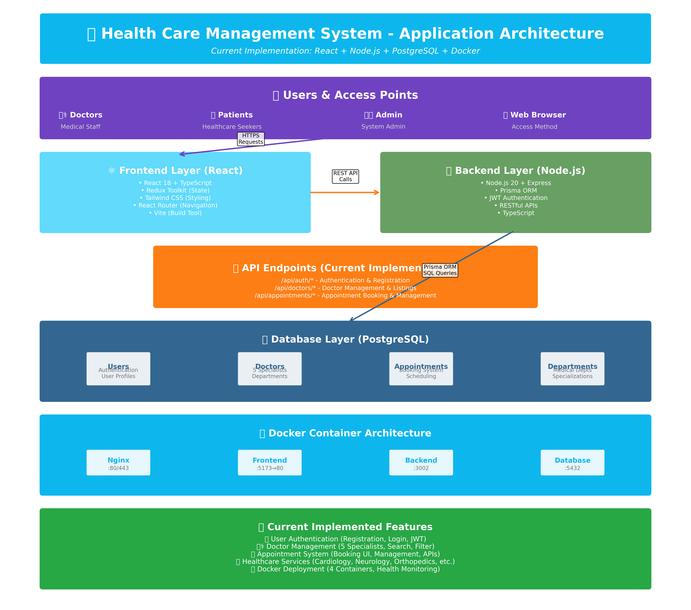
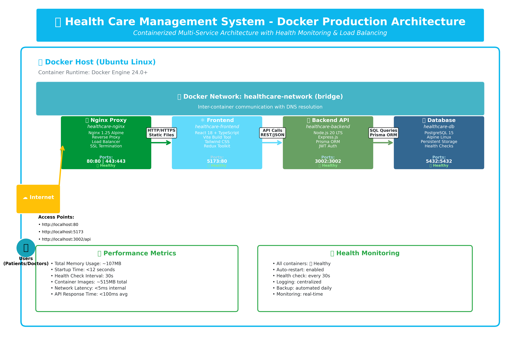
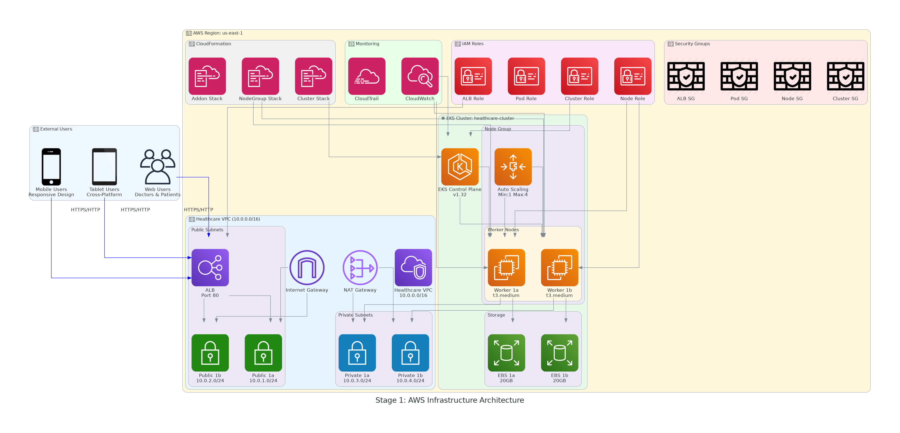
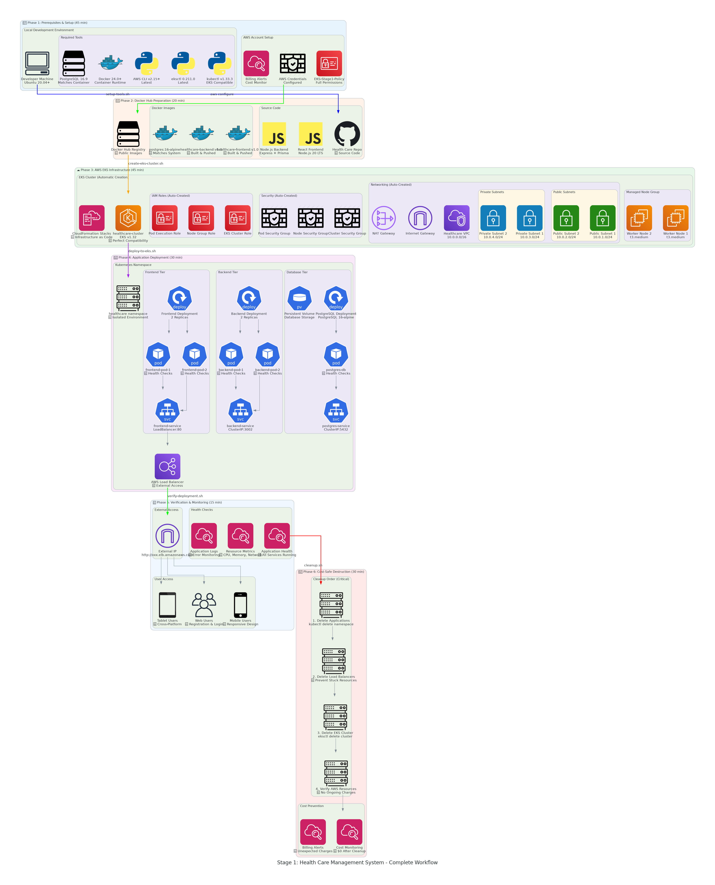

# 🏥 RouteClouds Health Platform
## Progressive CI/CD Pipeline Implementation for Healthcare Management System

A modern healthcare platform demonstrating **4-stage progressive CI/CD pipeline** from basic deployment to enterprise DevSecOps. Perfect for DevOps professionals at all skill levels.

---

## 🏗️ **Architecture Overview**

| **Application Architecture** | **Docker Architecture** |
|------------------------------|-------------------------|
|  |  |

---

## ⚡ **Key Features**

| **Category** | **Features** |
|--------------|--------------|
| **🔐 Authentication** | JWT-based auth, Role-based access, Secure portals |
| **📅 Appointments** | Real-time scheduling, Telemedicine support, Automated reminders |
| **👨‍⚕️ Doctor Management** | Advanced search, Specialization filters, Profile management |
| **🏥 Medical Records** | Digital health records, Secure storage, Patient history |
| **💬 Telemedicine** | Virtual consultations, Video conferencing, Digital prescriptions |

---

## 📁 **Project Structure**

| **Directory** | **Purpose** | **Contents** |
|---------------|-------------|--------------|
| **📂 src-code/** | Application source code | Frontend (React), Backend (Node.js), Docker configs |
| **📂 Project-Docs/** | Documentation hub | Architecture diagrams, setup guides, implementation docs |
| **📂 Project-Stages/** | Progressive CI/CD stages | 4 stages from basic to enterprise DevSecOps |

---

## 💻 **Technology Stack**

| **Layer** | **Technologies** | **Purpose** |
|-----------|------------------|-------------|
| **🎨 Frontend** | React 18.3, TypeScript, Vite, Tailwind CSS | Modern UI with type safety |
| **⚙️ Backend** | Node.js, Express, Prisma ORM, TypeScript | RESTful API with database ORM |
| **🗄️ Database** | PostgreSQL 16, Redis (caching) | Relational data with caching |
| **🐳 Containers** | Docker, Docker Compose | Containerized development |
| **☁️ Cloud** | AWS EKS, VPC, Load Balancer | Kubernetes orchestration |
| **🔐 Security** | JWT, HTTPS, RBAC | Authentication & authorization |

---

## 🚀 **Progressive CI/CD Pipeline Implementation**

**4-stage progressive pipeline** from basic deployment to enterprise DevSecOps - designed for all skill levels.

### **📊 Stage Overview**

| **Stage** | **Focus** | **Complexity** | **Target** | **Time** | **Status** |
|-----------|-----------|----------------|------------|----------|------------|
| **[Stage 1](Project-Stages/Project-Stage-1-Basic-CI-CD-Deploy/)** | Basic CI/CD | ⭐⭐☆☆☆ | Beginners | 2-3h | ✅ Ready |
| **[Stage 2](Project-Stages/Project-Stage-2-Automated-CI-CD-Pipeline/)** | Automated Pipeline | ⭐⭐⭐☆☆ | Intermediate | 4-6h | 🔄 In Progress |
| **[Stage 3](Project-Stages/Project-Stage-3-Advanced-DevOps-Monitoring/)** | Advanced Monitoring | ⭐⭐⭐⭐☆ | Advanced | 6-8h | 📋 Planned |
| **[Stage 4](Project-Stages/Project-Stage-4-Enterprise-DevSecOps/)** | Enterprise DevSecOps | ⭐⭐⭐⭐⭐ | Expert | 8-12h | 📋 Planned |

## 🎯 **Stage 1: Basic CI/CD Deployment** ✅

**Foundation stage** - Basic containerized deployment to AWS EKS with manual CI/CD workflow.

| **Stage 1 Infrastructure** | **Stage 1 Workflow** |
|----------------------------|----------------------|
|  |  |

### **🛠️ Technologies**
Docker + Docker Hub • AWS EKS • Kubernetes • PostgreSQL • Manual Scripts

### **📚 Documentation**
- **[📋 Setup Guide](Project-Stages/Project-Stage-1-Basic-CI-CD-Deploy/docs/comprehensive-setup-guide.md)** - Complete instructions
- **[🔧 Troubleshooting](Project-Stages/Project-Stage-1-Basic-CI-CD-Deploy/docs/troubleshooting.md)** - Common issues
- **[🗑️ Cleanup](Project-Stages/Project-Stage-1-Basic-CI-CD-Deploy/docs/stage-1-deletion-process.md)** - Resource cleanup

### **💰 Cost**: ~$151/month • **⏱️ Time**: 2-3 hours • **🎯 Level**: Beginner

---

## 🚀 **Quick Start**

### **👨‍💻 Local Development**
```bash
git clone https://github.com/RouteClouds/Health_Care_Management_System.git
cd Health_Care_Management_System/src-code
docker-compose up -d
```

### **☁️ CI/CD Pipeline (Stage 1)**
```bash
git clone https://github.com/RouteClouds/Health_Care_Management_System.git
cd Health_Care_Management_System/Project-Stages/Project-Stage-1-Basic-CI-CD-Deploy
cat docs/comprehensive-setup-guide.md
```

### **📋 Prerequisites**
| **Path** | **Requirements** |
|----------|------------------|
| **Local Dev** | Node.js 18+, Docker, Docker Compose |
| **Stage 1** | AWS Account, kubectl v1.33.3, eksctl 0.211.0+, Docker Hub |

---

## 📚 **Documentation**

| **Category** | **Links** |
|--------------|-----------|
| **📋 Setup Guides** | [Local Setup](Project-Docs/LOCAL_SETUP_GUIDE.md) • [Backend Guide](Project-Docs/BACKEND_IMPLEMENTATION_GUIDE.md) |
| **🔧 Troubleshooting** | [Git Issues](Project-Docs/CI-CD-Docs/Git-Troubleshoot-Guide.md) • [Stage 1 Issues](Project-Stages/Project-Stage-1-Basic-CI-CD-Deploy/docs/troubleshooting.md) |
| **🏗️ Architecture** | [App Architecture](Project-Docs/Images/App-Arch/) • [Docker Architecture](Project-Docs/Images/Docker-Arch/) |

---

## 🤝 **Contributing**

1. Fork the repository
2. Create feature branch: `git checkout -b feature/amazing-feature`
3. Commit changes: `git commit -m 'Add amazing feature'`
4. Push to branch: `git push origin feature/amazing-feature`
5. Open a Pull Request

---

## 📄 **License**

MIT License - see [LICENSE](LICENSE) file for details.

---

## 🎯 **Next Steps**

- **🏠 Local Development**: Start with `src-code/` directory
- **☁️ DevOps Learning**: Begin with Stage 1 for hands-on CI/CD experience
- **📚 Documentation**: Explore comprehensive guides in each stage
- **🤝 Community**: Join discussions and contribute to the project

**⭐ Star this repository if you find it helpful!**

